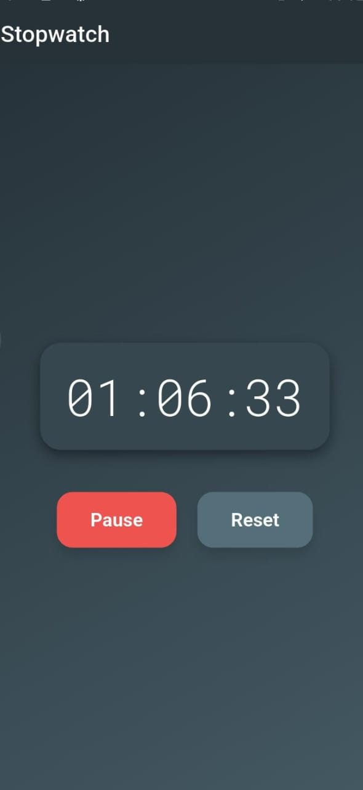

# ⏱️ Stopwatch App — CodeCraft Internship Task #2

This is my second internship task at **CodeCraft**, where I was assigned to build a **basic stopwatch app** in Flutter that includes:

* 🕐 Start, pause, and reset stopwatch functionality
* ⏳ Real-time display of minutes, seconds, and milliseconds
* 🎨 Aesthetic splash screen with app logo
* 🔊 Button press and reset sounds for enhanced user experience
* 📱 Smooth animations and a gradient-themed UI

---
## 🚀 Features

* **Flutter UI** with `MaterialApp`, `StatelessWidget`, `StatefulWidget`
* **Splash Screen** with fade animation using `AnimationController`
* **Stopwatch logic** handled via Dart's `Stopwatch` and `Timer`
* **Audio feedback** using the `audioplayers` package
* **Button animations** for tactile feel
* **Custom fonts and themes** for professional styling

---

## 🔧 Technologies & Packages

* `flutter` – UI framework
* `audioplayers` – for playing button and reset sound effects
* `Roboto` & `RobotoMono` fonts
* `LinearGradient`, `BoxShadow`, and `FadeTransition` – for modern design

---

## 📂 Project Structure

```text
assets/
  └── images/
      └── logo.png
  └── sounds/
      ├── button-press-beep-269718.mp3
      └── beep-329314.mp3
  └── screenshots/
      ├── ss
```
## 📸 Screenshots

 Stopwatch Screen |
|  |
